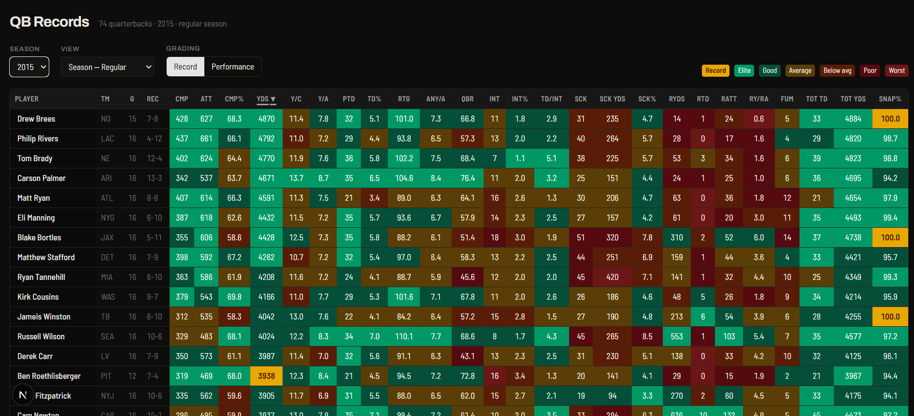
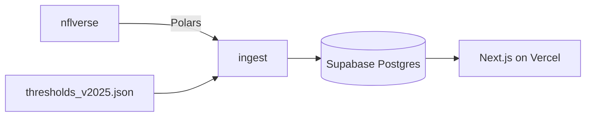

[](https://github.com/mrp5623/nfl_qb_record_tracker/actions/workflows/ci.yml)

# NFL QB Record Tracker

Track the weekly and yearly record pace and performance of NFL quarterbacks from 1999 to present!

**[View the live site →](https://nfl-qb-record-tracker.vercel.app/)**



## Why?

We'd made fun of our friend for years about the Bears' troubled quarterback history, but after they drafted Caleb Williams in 2024 he swore to us they'd finally found the man to free them from being the only team without a 4000 yard passer. I decided to check in on his claim a few weeks later with a simple Google Sheet that imported passing yards and highlighted the players on pace for 4000. Now, two years later, the Sheet evolved more than I could have imagined as more ideas flooded in and friends requested more features. It has definitely earned a real application to allow it to grow further. 

Also, its worth noting: as of the end of the 2025 NFL season the Chicago Bears STILL don't have a 4000 yard passer.

## 25+ seasons, 4 views, 2 modes
The record tracker lets you look at stats from this year as the games are played as well as go back in time to see the numbers players from years past were putting up. You can see week by week performances as well as cumulative stats from a whole year, with a seperate view for each in the postseason when the best of the best are playing their best (unless it Josh Allen). 

A toggle switches how the cells are color coded. Performance mode compares player stats with others from that same view to show you how a players performed against their most direct competition. Record mode compares player stats to thresholds derived from real stats to show how players are performing in a greater historical context with a special color for players on pace to break an NFL record.

## Architecture



| Stage | Where | What it does |
|---|---|---|
| Fetch | [`ingest/sources.py`](ingest/sources.py) | Pulls nflverse, verifies columns, normalizes team abbreviations |
| Derive | [`ingest/derive.py`](ingest/derive.py) | Passer rating, ANY/A, and the rest — pure functions, no I/O |
| Threshold | [`ingest/thresholds.py`](ingest/thresholds.py) | Generates and validates [`config/thresholds_v2025.json`](config/thresholds_v2025.json) |
| Grade | [`ingest/grade.py`](ingest/grade.py) | Assigns a tier and a percentile to every cell |
| Load | [`ingest/load.py`](ingest/load.py) | Idempotent upsert into Postgres |
| Serve | [`web/app/page.tsx`](web/app/page.tsx) | Server-rendered table, colour from tier names |

## Testing

Incorrect data doesn't crash, so tests have to catch invisible failures. I tested against known data when possible and against defined properties of the sheet when I couldn't. For example, nflverse records sack yards as negative, so my derived ANY/A was off by amounts small enough to be passable, but large enough to be signifcant. Without testing I probably never would've noticed.

```bash
pytest                      # all 182
pytest -m "not network"     # 155, no live nflverse calls — what CI runs
```

## Running it locally

**Prerequisites:** Python 3.13, Node 22, a Supabase project.

```bash
# 1. Database
psql "$DATABASE_URL" -f db/migrations/schema1.sql
psql "$DATABASE_URL" -f db/migrations/schema2_rls.sql
psql "$DATABASE_URL" -f db/migrations/schema3_index_views.sql

# 2. Pipeline
cp .env.example .env          # add your DATABASE_URL
pip install -e ".[dev]"
python -m ingest.load         # full 1999-present load, ~2 min

# 3. App
cd web
cp .env.example .env.local    # add your Supabase URL + publishable key
npm install
npm run dev
```

During the season, `python -m ingest.load` after games refreshes everything. Rerunning is always safe.

## Data

Play-by-play and schedule data from [nflverse](https://github.com/nflverse/nflverse-data),
1999 onward. ESPN QBR from 2006, snap counts from 2013.

Note: nflverse data is not perfect. A few entires have been found that do not match verified statistics published by the NFL.

## Future

This project has been something I've constantly found ways to build on for years so I doubt this is the end for it. Next up is defintely an automated stat refresh after every gameday. Future features: years 1966-1998, player page, rollback to past week (view the season page as it look on week _ of year _), add more advanced statistics and predictions, normalize by snap count instead of games, and more!

## License

[MIT](LICENSE)
